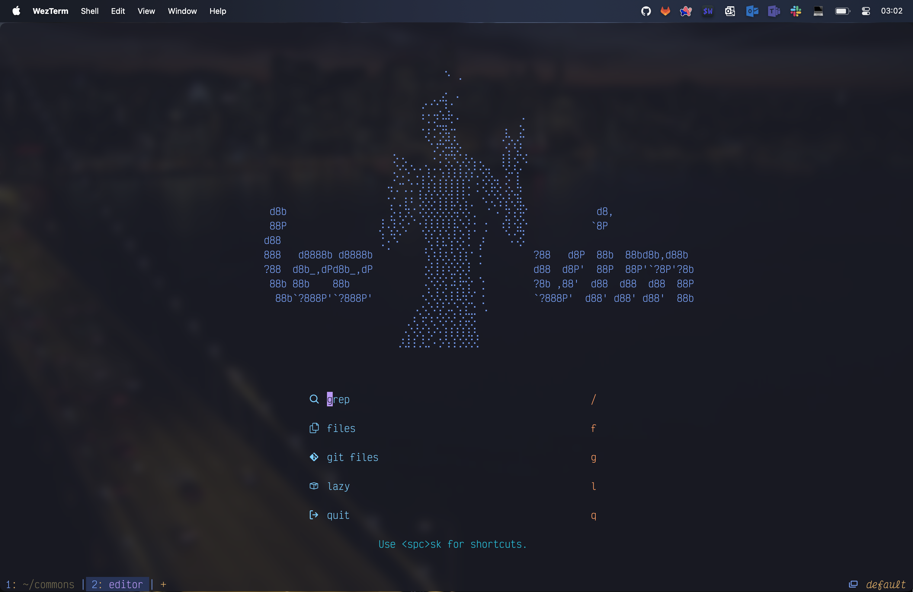
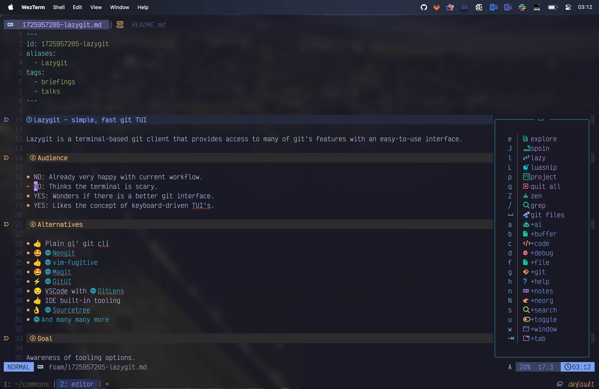
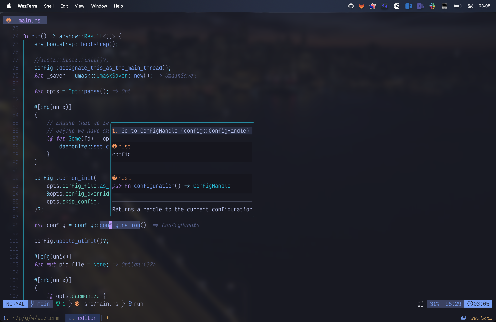
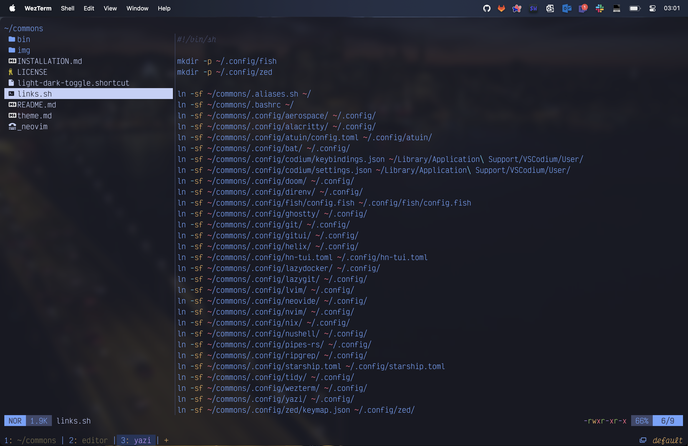
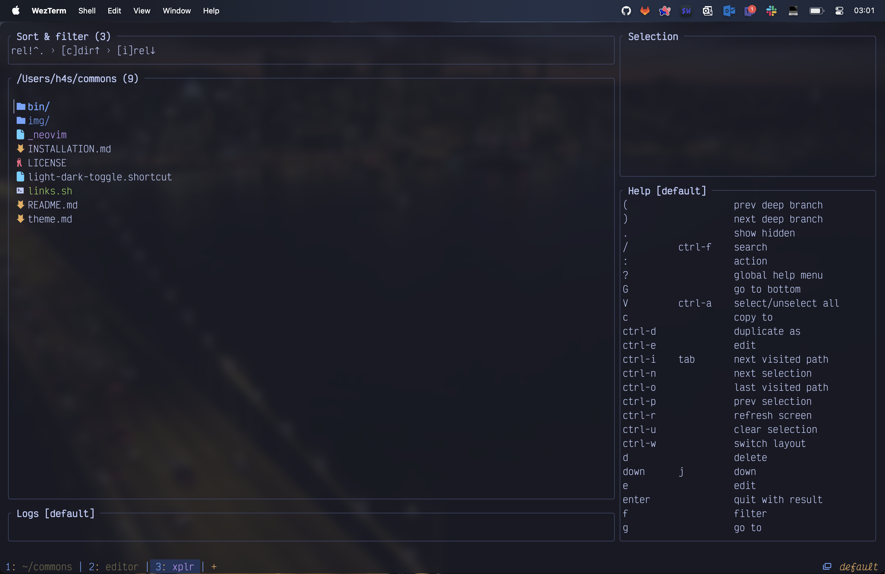

# theherk commons

## Common Environment Configuration

These are the configuration details and files I use to configure my environment. Feel free to peruse if it suits you.

<a href="#screenshots"> 📷️ Screenshots</a> | <a href="./INSTALLATION.md"> 🚀 Installation</a>

## Tools 🛠️

- terminal: [wezterm](https://wezfurlong.org/wezterm/) 💻: [configuration](.config/wezterm/)
- shell: [fish](https://fishshell.com/) 🐠: [configuration](.config/fish/config.fish)
- editor: [neovim](https://neovim.io/) ✏️: [configuration](.config/nvim/)
- font: [Victor Mono](https://rubjo.github.io/victor-mono/) 🔠: Best font ever. 🌟

### Miscellaneous Other Tools 🎒

- [asciinema](https://asciinema.org/): Record and share terminal sessions.
- [bat](https://github.com/sharkdp/bat): A cat clone.
- [caddy](https://github.com/caddyserver/caddy): Simple file server.
- [coreutils](https://www.gnu.org/software/coreutils/): GNU core utilities.
- [direnv](https://direnv.net/): Environment manipulation.
- [doll](https://github.com/xiaogdgenuine/Doll): Move dock applications to menu bar.
- [dozer](https://github.com/Mortennn/Dozer): Hide menu bar icons on macOS.
- [dua](https://github.com/Byron/dua-cli): Disk usage analyzer cli with interactive option.
- [dust](https://github.com/bootandy/dust): A more intuitive version of du in rust.
- [editorconfig](https://editorconfig.org/): Enforce some text styles.
- [eza](https://eza.rocks/): A modern, maintained replacement for ls.
- [fd](https://github.com/sharkdp/fd): Fast, user-friendly find.
- [fzf](https://github.com/junegunn/fzf): Command-line fuzzy finder.
- [delta](https://github.com/dandavison/delta): Syntax highlighting pager.
- [grip](https://github.com/joeyespo/grip): Preview markdown.
- [keycastr](https://github.com/keycastr/keycastr): Keystroke visualizer.
- [lazydocker](https://github.com/jesseduffield/lazydocker): Container management TUI.
- [lazygit](https://github.com/jesseduffield/lazygit): The best git interface outside emacs.
- [navi](https://github.com/denisidoro/navi): Interactive cheatsheet tool for the command-line.
- [pandoc](https://pandoc.org/): Universal document converter.
- [podman](https://podman.io/): Daemonless container engine.
- [pyenv](https://github.com/pyenv/pyenv): Simple python version management.
- [ripgrep](https://github.com/BurntSushi/ripgrep): Amazing search tool.
- [silicon](https://github.com/Aloxaf/silicon): Create beautiful image of your source code.
- [skim](https://github.com/lotabout/skim): Awesome fuzzy finder.
- [starship](https://starship.rs/): Customizable prompt.
- [tokei](https://github.com/XAMPPRocky/tokei): Great tool for counting code.
- [xh](https://github.com/ducaale/xh): Friendly tool for sending http requests.
- [xplr](https://xplr.dev/): Powerful file manager.
- [yazi](https://yazi-rs.github.io/): Simple file manager.
- [zellij](https://zellij.dev/): A terminal workspace with batteries included; multiplexer.
- [zoxide](https://github.com/ajeetdsouza/zoxide): A smarter cd command. Supports all major shells.

## Screenshots 🖼️

## Credits

More are warranted, but the two I can think to mention off the bat are:

- [matlocktheartist](https://www.deviantart.com/matlocktheartist/art/Bruce-Lee-Puzzled-322967405) for providing the awesome Bruce Lee art.

## Enjoy 🤗
