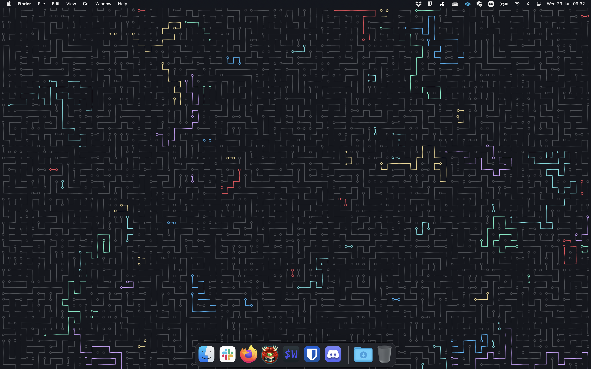
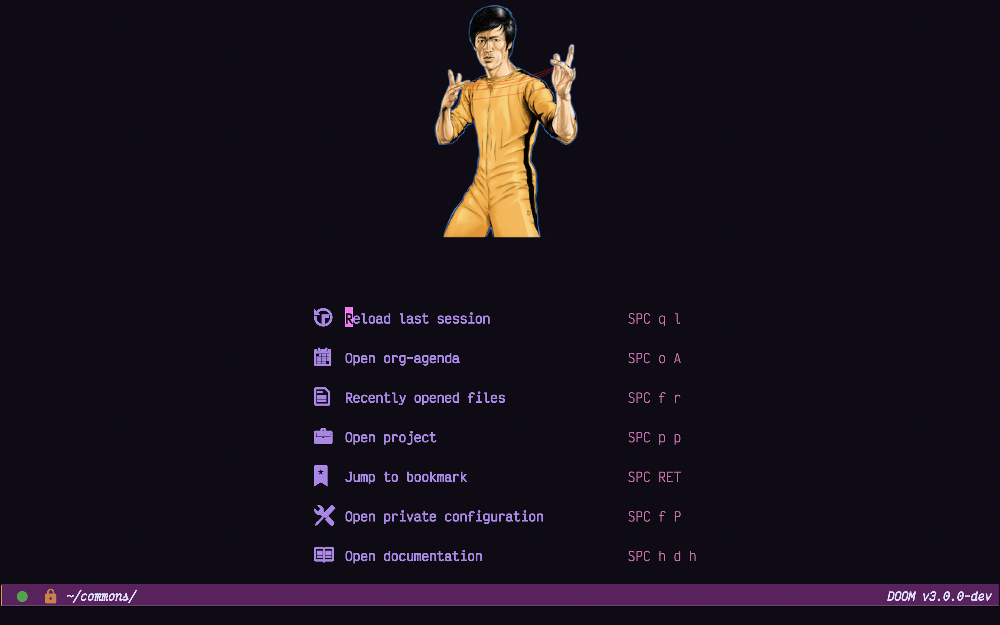
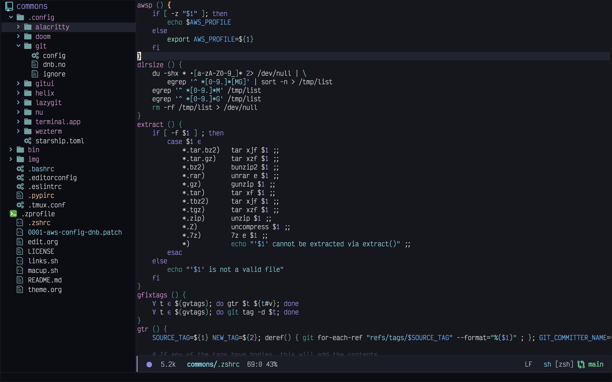
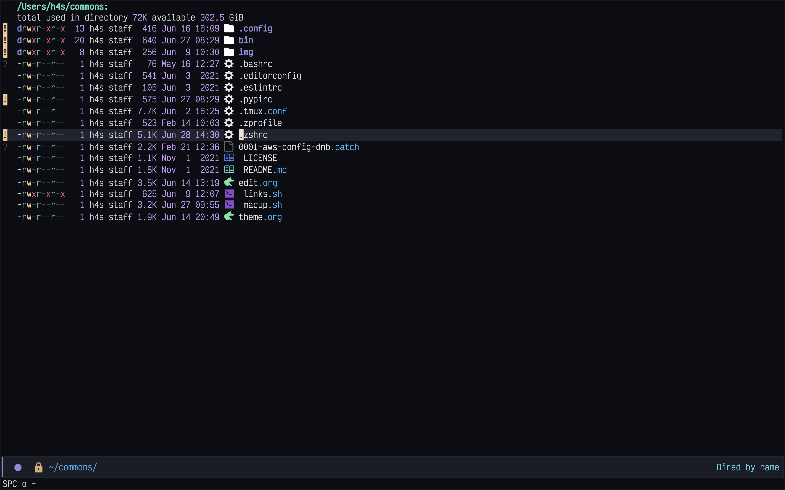
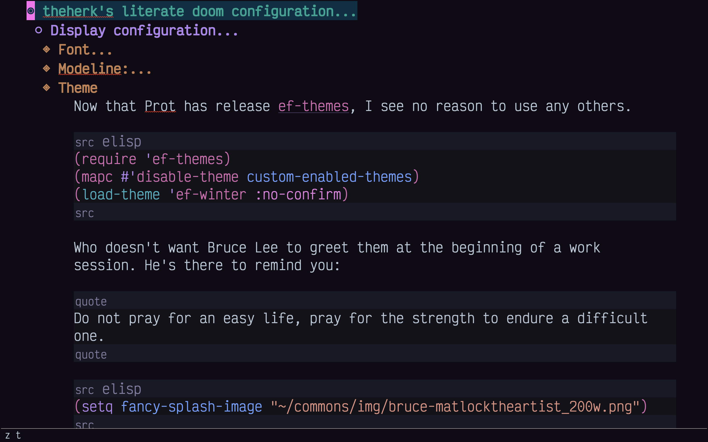
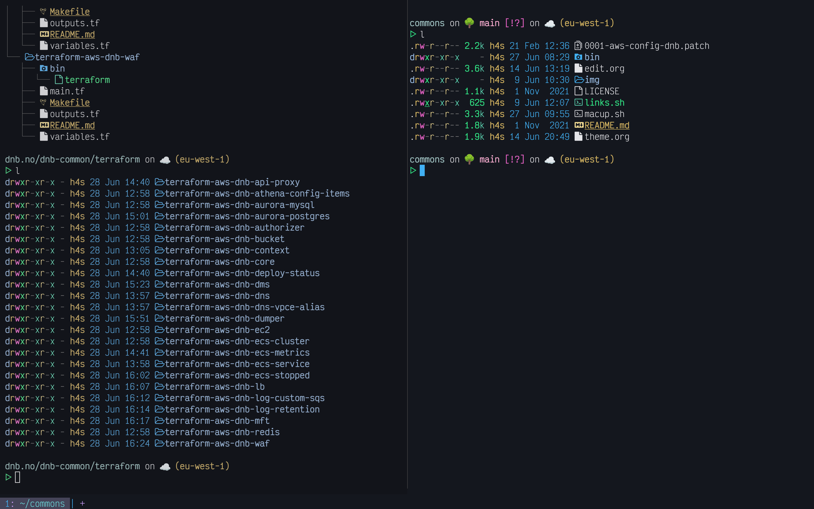
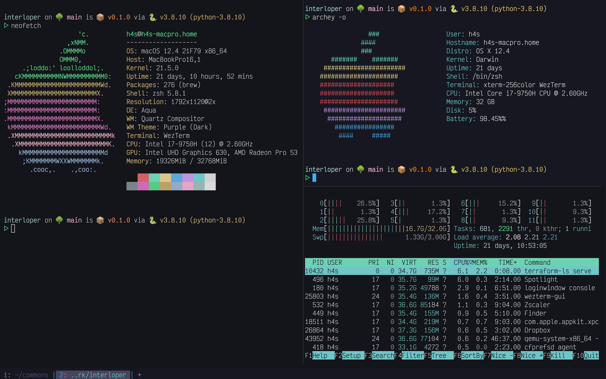

# theherk commons

These are the configuration details and files I use to configure my environment. Feel free to peruse if it suits you.

_update 2021-06-29_: The koolaid is delicious. I have removed most things that were unique to Arch, Manjaro, and Windows. Not that I'll never use them, but probably not often. Nevertheless, if you seek files that were used in that linux context, like X configuration, termite, rofi, i3, etc. check out one of the blockpoints up to b3.

## Features

- [Kaolin Emacs Themes](https://github.com/ogdenwebb/emacs-kaolin-themes) / [Kaolin Inspired Themes](https://github.com/alternateved/kaolin-inspired)
- [Doom Emacs](https://github.com/hlissner/doom-emacs)
- [Bruce Lee](https://en.wikipedia.org/wiki/Bruce_Lee)
- [screenshots below](#screenshots)

## Installation

#### Get this repository.

    git clone git@gitlab.com:theherk/commons.git ~
    # git clone https://gitlab.com/theherk/commons.git ~ # in case you aren't me

#### Link everything where to needs to be.

    ~/commons/links.sh

#### Bootstap mac os configuration.

You can't really just run this unattended.

    # ~/commons/macup.sh

But you can follow [the script](macup.sh) as copypasta steps.

## emacs literate configuration

You can find my configuration [here](.config/doom/config.org).

## Screenshots

#### desktop

#### emacs

#### firefox

#### slack

#### wuzterm

## Credits

More are warranted, but the two I can think to mention off the bat are:

- [matlocktheartist](https://www.deviantart.com/matlocktheartist/art/Bruce-Lee-Puzzled-322967405) for providing the awesome Bruce Lee art.

## Enjoy
