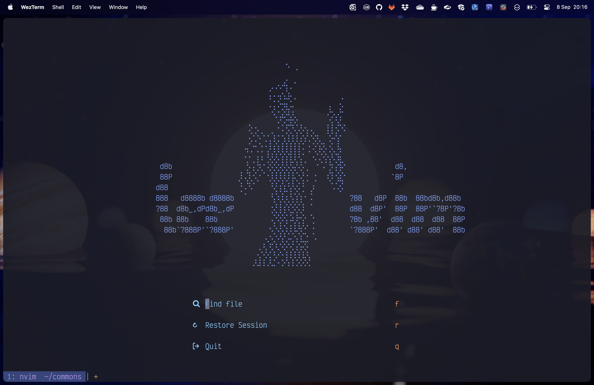
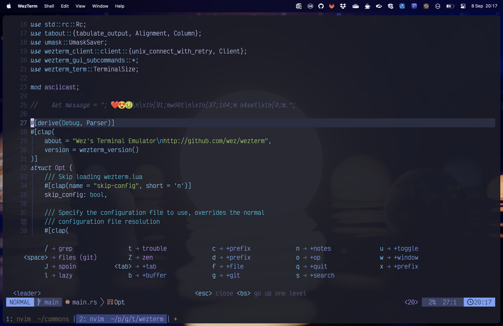
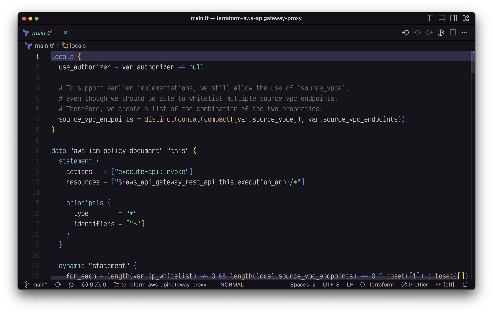
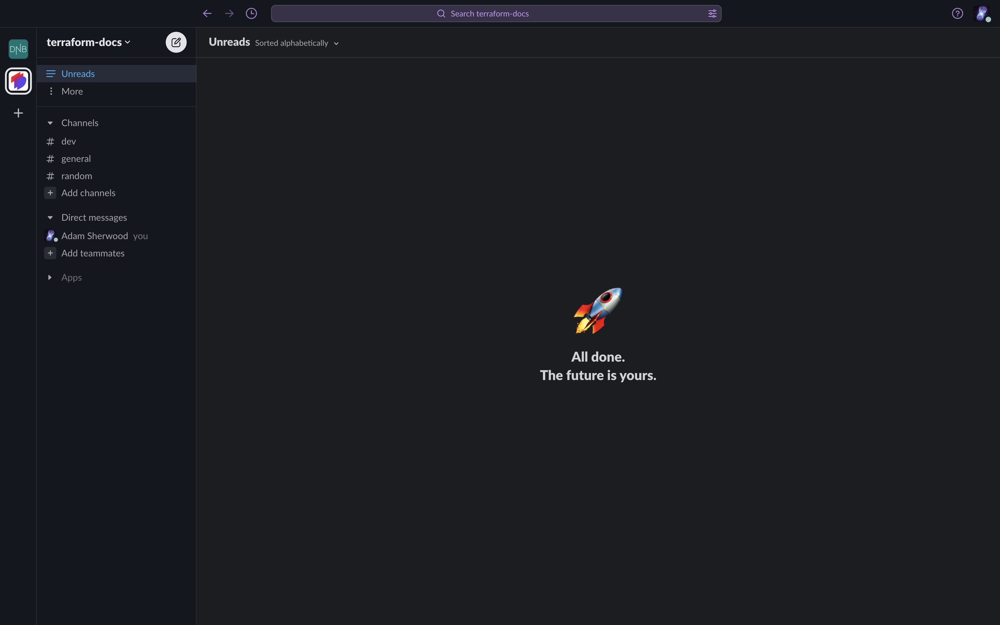
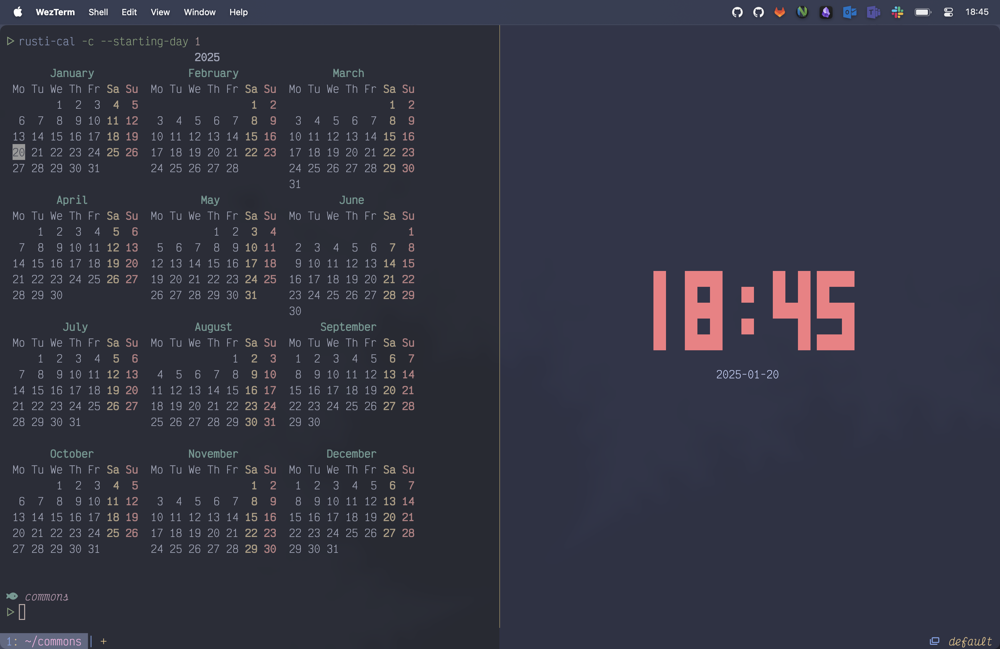
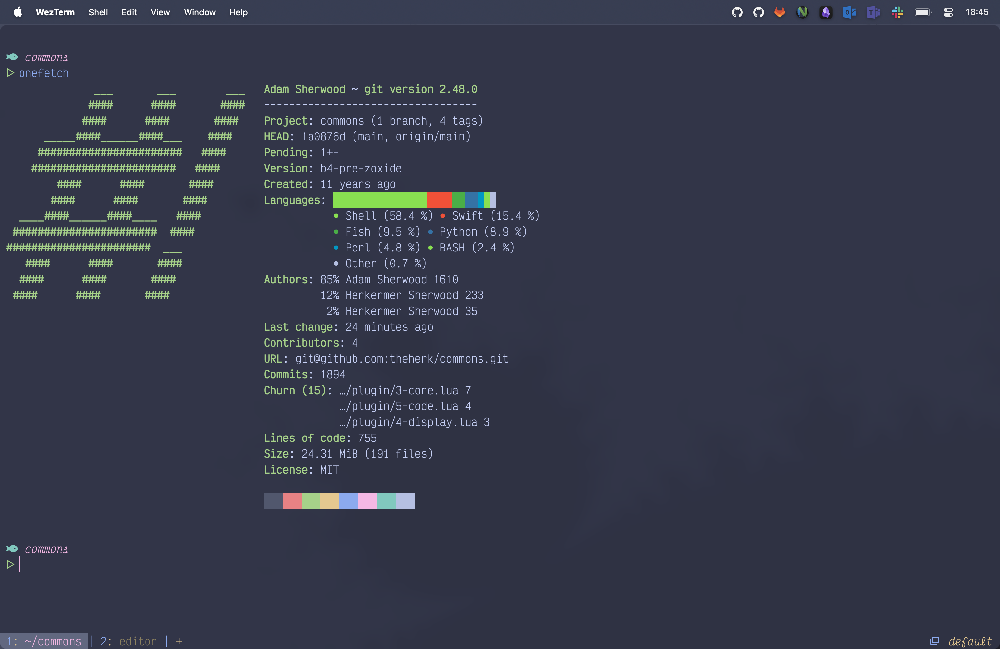

# theherk commons
## Common Environment Configuration

These are the configuration details and files I use to configure my environment. Feel free to peruse if it suits you.

<a href="#screenshots"> 📷️ Screenshots</a> | <a href="./INSTALLATION.md"> 🚀 Installation</a>

## Tools 🛠️

### Editors ⌨️

1. [neovim](https://neovim.io/): 1993-2015, 2023-current ❤️
2. [doom emacs](https://github.com/doomemacs/doomemacs): 2015-2023 🪦
3. [Helix](https://helix-editor.com/) 🦀
4. [Codium](https://vscodium.com/) 🤒

### Terminal 🖥️

- [fish](https://fishshell.com/) 🐠
- [wezterm](https://wezfurlong.org/wezterm/) 💻: [configuration](.config/wezterm/wezterm.lua)

### Miscellaneous Other Tools 🎒

A partial list of installed tools:

- [asciinema](https://asciinema.org/): Record and share terminal sessions.
- [bat](https://github.com/sharkdp/bat): A cat clone.
- [caddy](https://github.com/caddyserver/caddy): Simple file server.
- [coreutils](https://www.gnu.org/software/coreutils/): GNU core utilities.
- [direnv](https://direnv.net/): Environment manipulation.
- [doll](https://github.com/xiaogdgenuine/Doll): Move dock applications to menu bar.
- [dozer](https://github.com/Mortennn/Dozer): Hide menu bar icons on macOS.
- [dropbox](https://formulae.brew.sh/cask/dropbox): Only for syncing org directory.
- [dua](https://github.com/Byron/dua-cli): Disk usage analyzer cli with interactive option.
- [editorconfig](https://editorconfig.org/): Enforce some text styles.
- [eza](https://eza.rocks/): A modern, maintained replacement for ls.
- [fd](https://github.com/sharkdp/fd): Fast, user-friendly find.
- [fzf](https://github.com/junegunn/fzf): Command-line fuzzy finder.
- [firefox](https://www.mozilla.org/en-US/firefox/new/): Best web browser.
- [delta](https://github.com/dandavison/delta): Syntax highlighting pager.
- [gitui](https://github.com/extrawurst/gitui): Fast terminal ui for git.
- [grip](https://github.com/joeyespo/grip): Preview markdown.
- [keycastr](https://github.com/keycastr/keycastr): Keystroke visualizer.
- [lazydocker](https://github.com/jesseduffield/lazydocker): Container management TUI.
- [lazygit](https://github.com/jesseduffield/lazygit): The best git interface outside emacs.
- [navi](https://github.com/denisidoro/navi): Interactive cheatsheet tool for the command-line.
- [neovide](https://neovide.dev/): Neovim Client in Rust.
- [pandoc](https://pandoc.org/): Universal document converter.
- [podman](https://podman.io/): Daemonless container engine.
- [pyenv](https://github.com/pyenv/pyenv): Simple python version management.
- [ripgrep](https://github.com/BurntSushi/ripgrep): Amazing search tool.
- [shadowenv](https://github.com/Shopify/shadowenv): Slightly better, but less integrated environment manipulation.
- [silicon](https://github.com/Aloxaf/silicon): Create beautiful image of your source code.
- [skim](https://github.com/lotabout/skim): Awesome fuzzy finder.
- [starship](https://starship.rs/): Customizable prompt.
- [terraform](https://www.terraform.io/): Infrastructure management tool.
- [tokei](https://github.com/XAMPPRocky/tokei): Great tool for counting code.
- [xh](https://github.com/ducaale/xh): Friendly tool for sending http requests.
- [zellij](https://zellij.dev/): A terminal workspace with batteries included; multiplexer.
- [zoxide](https://github.com/ajeetdsouza/zoxide): A smarter cd command. Supports all major shells.

### Font ✏️

I use [Victor Mono](https://rubjo.github.io/victor-mono/), and it is superb.

## Languages 📙

I use these mostly, though others are supported.

- [Rust Programming Language](https://www.rust-lang.org/)
- [Welcome to Python.org](https://www.python.org/)
- [The Go Programming Language](https://go.dev/)
- [Terraform by HashiCorp](https://www.terraform.io/)

## Screenshots 🖼️

### Vim

### Emacs

### Codium

### Slack

### Wezterm

## Credits

More are warranted, but the two I can think to mention off the bat are:

- [matlocktheartist](https://www.deviantart.com/matlocktheartist/art/Bruce-Lee-Puzzled-322967405) for providing the awesome Bruce Lee art.

## Enjoy 🤗
