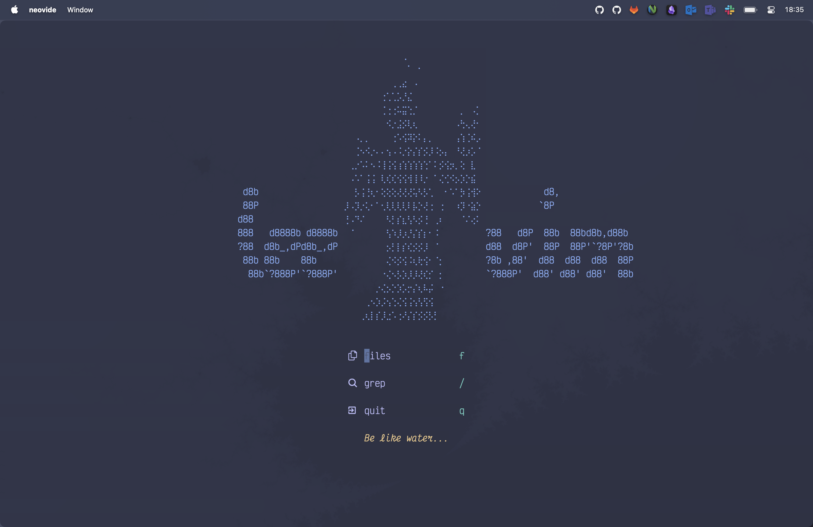
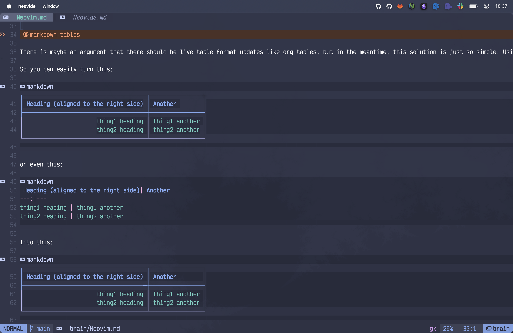
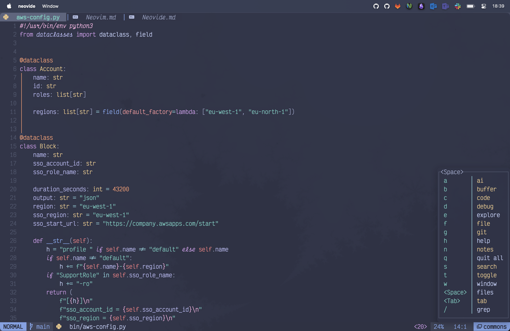
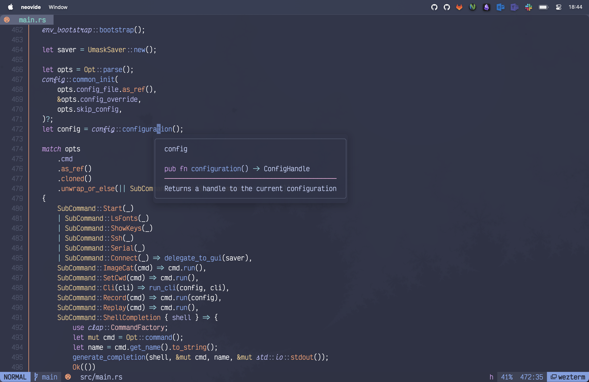
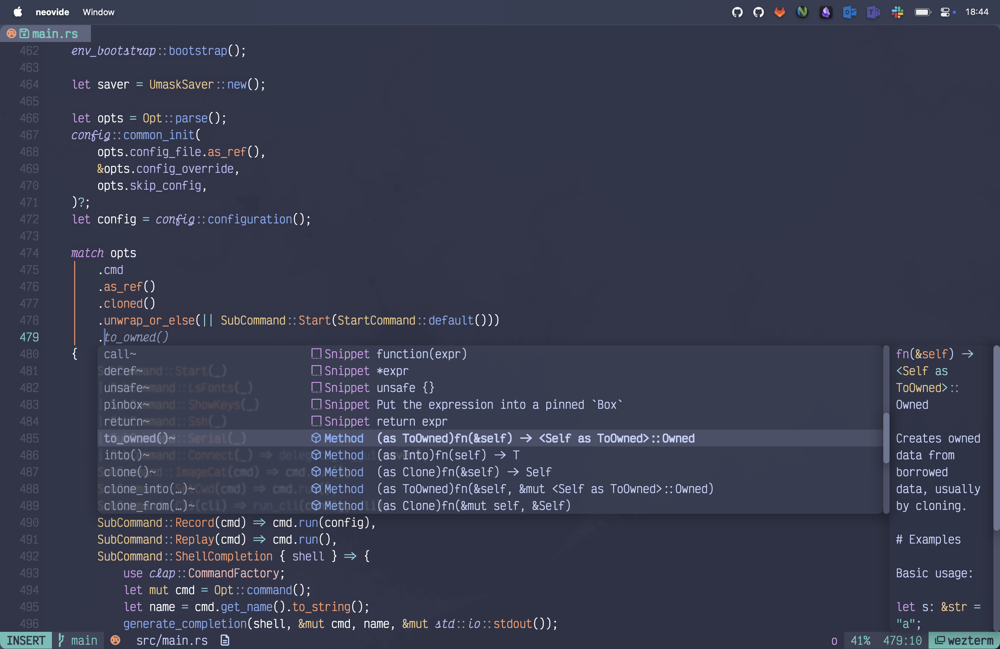
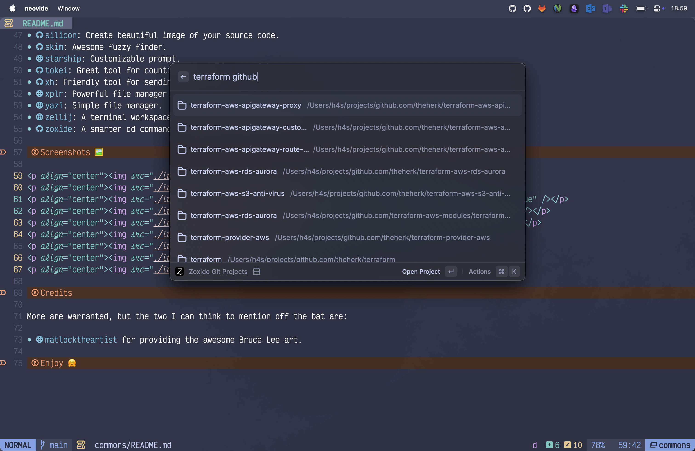
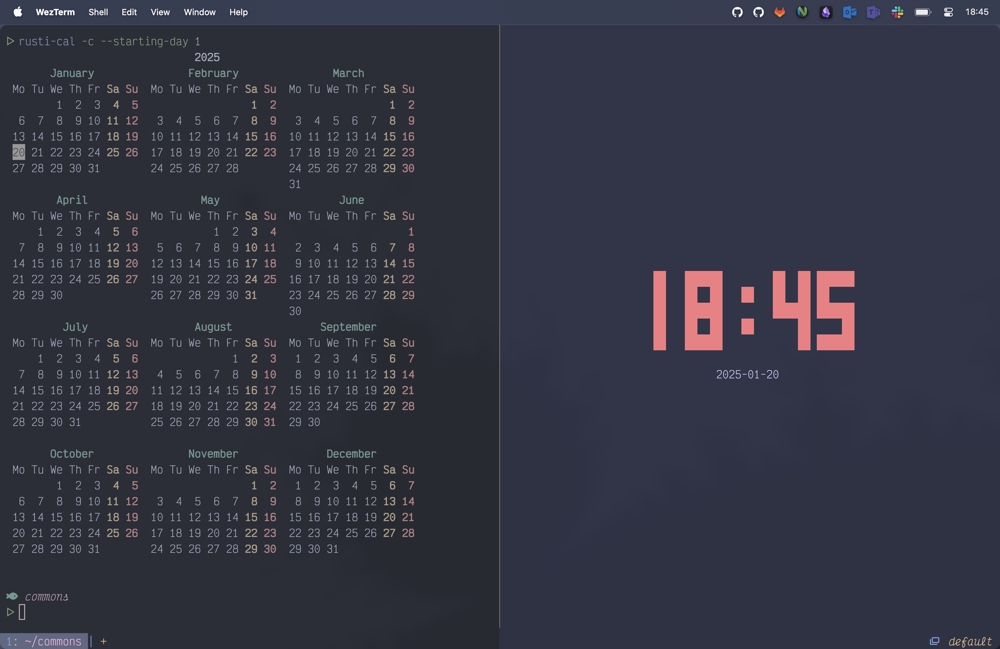
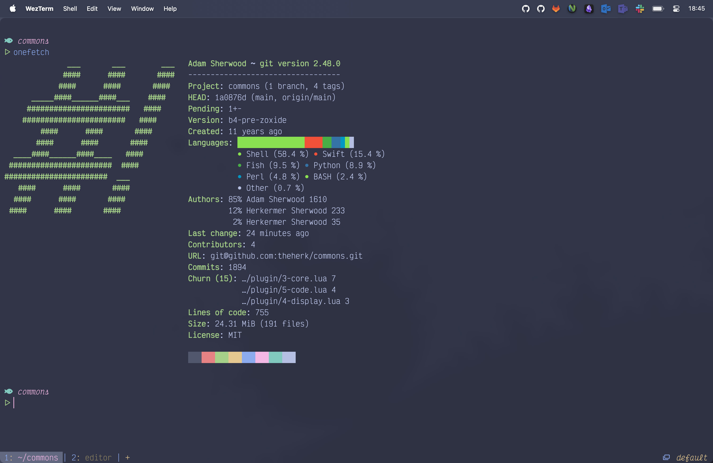
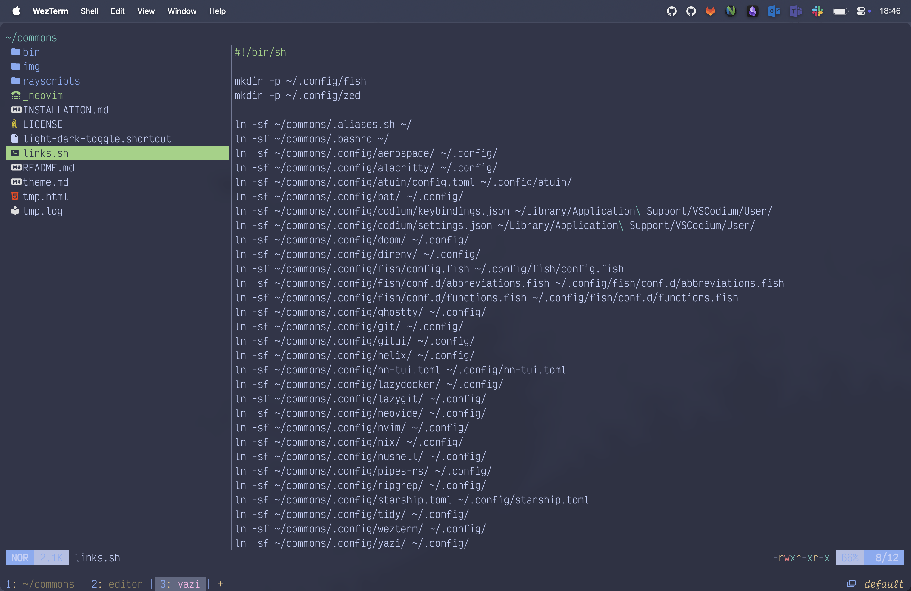

# theherk commons

## Common Environment Configuration

These are the configuration details and files I use to configure my environment. Feel free to peruse if it suits you.

<a href="#screenshots-%EF%B8%8F"> 📷️ Screenshots</a> | <a href="./INSTALLATION.md"> 🚀 Installation</a>

## Tools 🛠️

While this configuration does prepare a great many tools, it revolves primarily around the following:

- [Aerospace](https://github.com/nikitabobko/AeroSpace): Tiling window manager. [configuration](.config/aerospace/)
- [Neovim](https://neovim.io/): King of modal editors. [configuration](.config/nvim/)
- [Fish](https://fishshell.com/): User-friendly shell with vi mode. [configuration](.config/fish/config.fish)
- [Wezterm](https://wezfurlong.org/wezterm/): Muxing, GPU-accelerated terminal. [configuration](.config/wezterm/)
- [Jujutsu](https://github.com/jj-vcs/jj): Simple, git-compatible VCS. [configuration](.config/jj/)
- [Victor Mono](https://rubjo.github.io/victor-mono/): Best font ever.

### Miscellaneous Other Tools

- [asciinema](https://asciinema.org/): Record and share terminal sessions.
- [atuin](https://github.com/atuinsh/atuin): Shell history with sync and search.
- [bat](https://github.com/sharkdp/bat): A cat clone.
- [caddy](https://github.com/caddyserver/caddy): Simple file server.
- [carapace](https://github.com/carapace-sh/carapace): Multi-shell completion bridge.
- [coreutils](https://www.gnu.org/software/coreutils/): GNU core utilities.
- [direnv](https://direnv.net/): Environment manipulation.
- [doll](https://github.com/xiaogdgenuine/Doll): Move dock applications to menu bar.
- [dozer](https://github.com/Mortennn/Dozer): Hide menu bar icons on macOS.
- [dua](https://github.com/Byron/dua-cli): Disk usage analyzer cli with interactive option.
- [dust](https://github.com/bootandy/dust): A more intuitive version of du in rust.
- [editorconfig](https://editorconfig.org/): Enforce some text styles.
- [eza](https://eza.rocks/): A modern, maintained replacement for ls.
- [fd](https://github.com/sharkdp/fd): Fast, user-friendly find.
- [flashspace](https://github.com/wojciech-kulik/FlashSpace): virtual workspace manager
- [fzf](https://github.com/junegunn/fzf): Command-line fuzzy finder.
- [delta](https://github.com/dandavison/delta): Syntax highlighting pager.
- [ghostty](https://ghostty.org/): GPU-accelerated terminal emulator.
- [grip](https://github.com/joeyespo/grip): Preview markdown.
- [keycastr](https://github.com/keycastr/keycastr): Keystroke visualizer.
- [kindavim](https://github.com/godbout/kindavim): Vim-style navigation for macOS.
- [lazydocker](https://github.com/jesseduffield/lazydocker): Container management TUI.
- [lazygit](https://github.com/jesseduffield/lazygit): The best git interface outside emacs.
- [mise](https://github.com/jdx/mise): Polyglot runtime version manager.
- [navi](https://github.com/denisidoro/navi): Interactive cheatsheet tool for the command-line.
- [Neovide](https://neovide.dev/): Smooth-scrolling Neovim GUI; occasional use.
- [NeovideProject](https://github.com/theherk/NeovideProject): Project switching with [Zoxide Git Projects](https://www.raycast.com/theherk/zoxide-git-projects).
- [pandoc](https://pandoc.org/): Universal document converter.
- [podman](https://podman.io/): Daemonless container engine.
- [ripgrep](https://github.com/BurntSushi/ripgrep): Amazing search tool.
- [silicon](https://github.com/Aloxaf/silicon): Create beautiful image of your source code.
- [starship](https://starship.rs/): Customizable prompt.
- [tokei](https://github.com/XAMPPRocky/tokei): Great tool for counting code.
- [uv](https://github.com/astral-sh/uv): Fast Python package manager.
- [vivid](https://github.com/sharkdp/vivid): LS_COLORS theme generator.
- [xh](https://github.com/ducaale/xh): Friendly tool for sending http requests.
- [yazi](https://yazi-rs.github.io/): Simple file manager.
- [zellij](https://zellij.dev/): A terminal workspace with batteries included; multiplexer.
- [zoxide](https://github.com/ajeetdsouza/zoxide): A smarter cd command. Supports all major shells.

## Screenshots 📷️

## Credits

More are warranted, but the two I can think to mention off the bat are:

- [matlocktheartist](https://www.deviantart.com/matlocktheartist/art/Bruce-Lee-Puzzled-322967405) for providing the awesome Bruce Lee art.

## Enjoy 🤗
